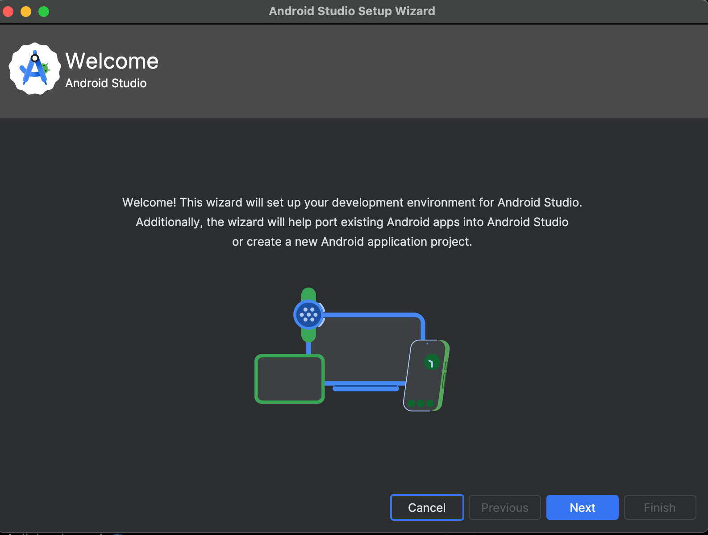
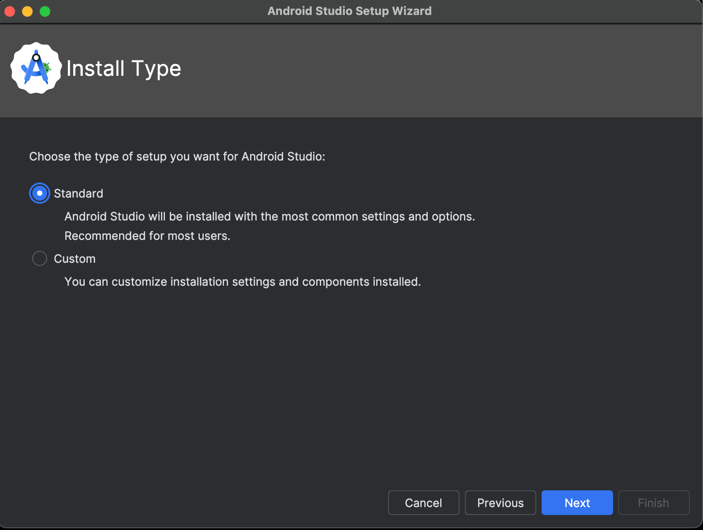
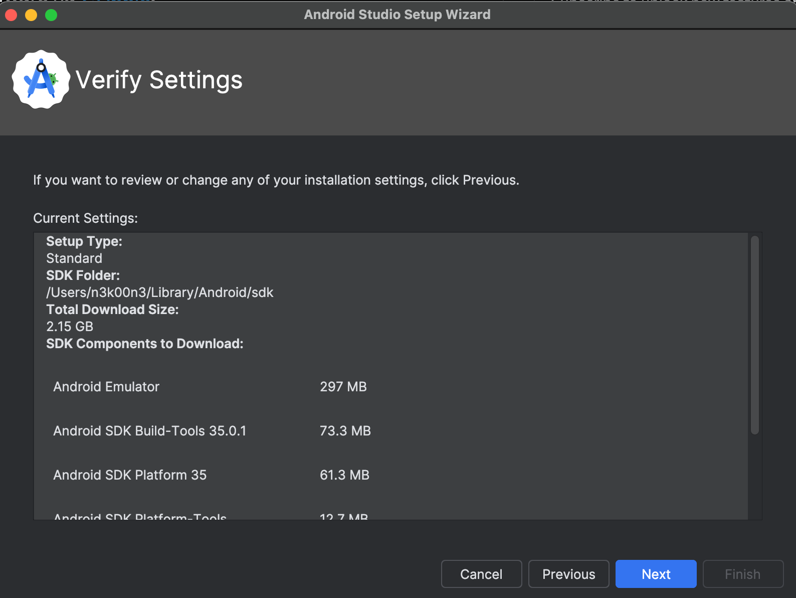
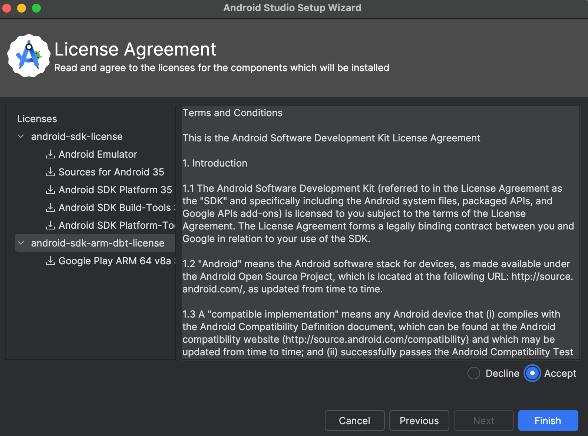
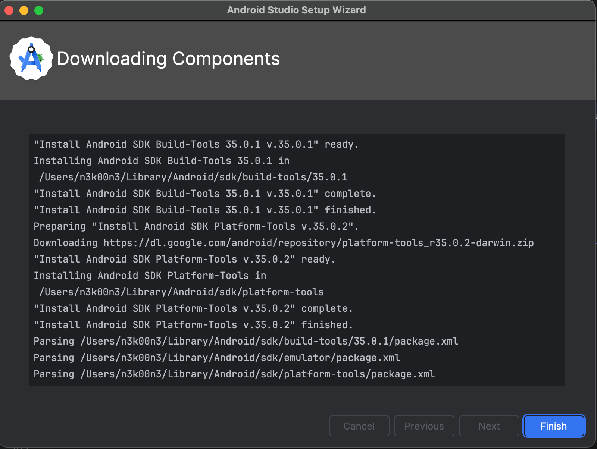

# Configurando Ambiente de Testes

Durante o livro utilizaremos emuladores de Android para os testes. Utilizaremos tanto a aplicação Genymotion como o emulador do próprio Android Studio. Fique a vontade para escolher o que melhor se adaptar. Eu costumo utilizar mais o Genymotion.

### Genymotion - Emulador Android

Para instalar o Genymotion seja no windows, linux ou no MacOS é necessário criar uma conta e  realizar o download no seguinte site: https://www.genymotion.com/product-desktop/.

A instalação é simples como qualquer outra aplicação.

### Android Studio

A instalação do Android Studio também é fácil, uma vez que segue a lógica de aplicações windows. Mas ainda assim vamos tratar dessa instalação para assim descrever a criação de AVD (Android Virtual Device).

Os passos para a instalação são basicamente Next, Next e Finish como podem ser vistas na imagens abaixo. É importante aceitar as licenças do Android SDK e Android SDK ARM para finalizar a instalação.









Agora só ir buscar um café enquanto espera a instalação.



As pastas das ferramentas que são instaladas juntos com o Android Studio podem ser localizadas nos seguintes caminhos:

##### MacOS

Android Emulator

```bash
/Users/USER/Library/Android/sdk/emulator
```

ADB

```bash
/Users/USER/Library/Android/sdk/platform-tools
```

##### Windows


##### Linux 


### BurpSuite 

Burpsuite é um proxy muito útil durante os testes de segurança em web e aplicações móveis. O burpusuite fica entre o cliente que em nosso contexto do livro são os aplicativos Android e o Servidor a qual a aplicação se comunica. 

A in
https://portswigger.net/burp/releases/professional-community-2024-1-1-6


### Jadx - Dex to Java Decompiler

A instalação da ferramenta Jadx é bem simples, uma vez que já existe um tutorial de instalação no repositório GitHub da própria ferramenta. Basta seguir os passos, de acordo com a sua arquitetura e Sistema Operacional que podem ser vistos na seguinte URL: https://github.com/skylot/jadx?tab=readme-ov-file#install

### Frida-Tools - Dispositivo com root
O pacote de ferramenta frida é composto de alguns utilitários para a análise e instrumentação dinâmica. A instrumentação dinâmica é a ação de explorar o aplicativo enquanto ele está em execução (esse tema será abordado em outra seção desse e-book). As ferramentas que compõe o pacote são: frida (instrumentador dinâmico), frida-trace (permite que o pentester inpecione chamadas a funções), frida-ps (lista todos os processos (aplicativos) no dispositivo), frida-ls-devices (lista os dispositivos em que o frida (instrumentador dinâmico) pode se conectar.

Mas, e ai? Como instalar esse pacote de ferramentas?

O client é instalado bem facilmente, apenas por executar o comando: 

```bash
pip(2-3...) install frida-tools
```
e para remover, executa o comando:

```bash
pip(2-3...) uninstall frida-tools
```

Já o server, pois o tipo de comunicação do frida é client <-> server, pode ser instalado facilmente seguindo as etapas abaixo encontradas na documentação oficial do frida.


Explicando o passo a passo da figura:

1 - Baixa o binário do frida-server no repositório oficial com base na sua arquitetura e sistema (https://github.com/frida/frida/releases)

2 - Extrai o binário

3 - Garante que o seu adb está com privilégio administrativo no sistema Android

4 - Faz o upload do binário do frida-server para o sistema Android no diretório /data/local/tmp

5 - Conceder as permissões para o binário ser executado corretamente

6 - Iniciar o servidor do frida.

Obs: em alguns casos pode ocorrer o seguinte:


Em situações como essas, você poderá executar os comando utilizando do adb shell "su -c comando" 


### Frida - Dispositivo sem root

### Objection

### LSPosed (Old XPosed) Framework

### AntiSplit

### ApkTools

### APK-mitm

#### MobSF


